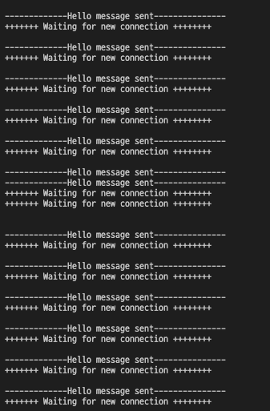
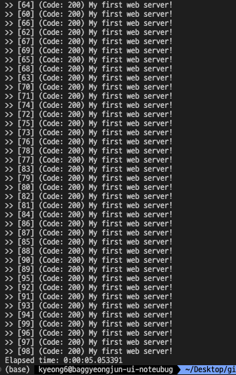
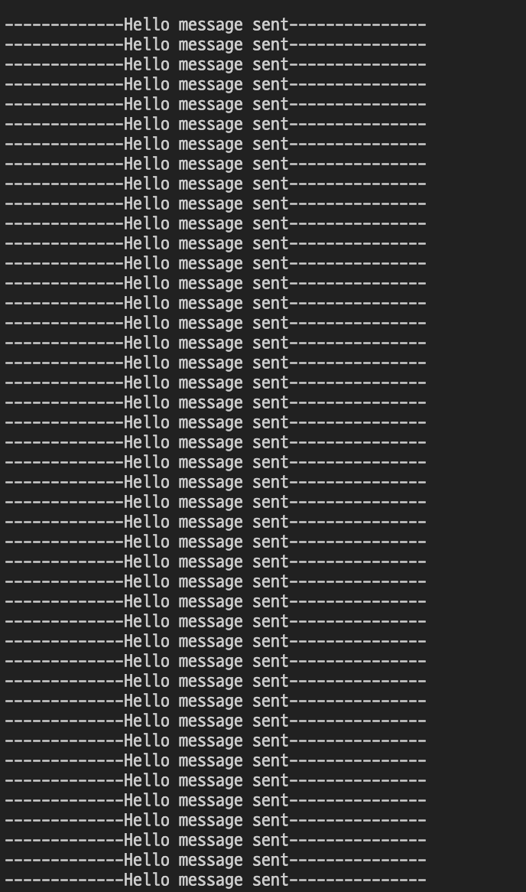
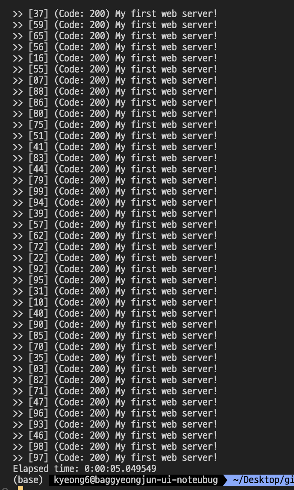
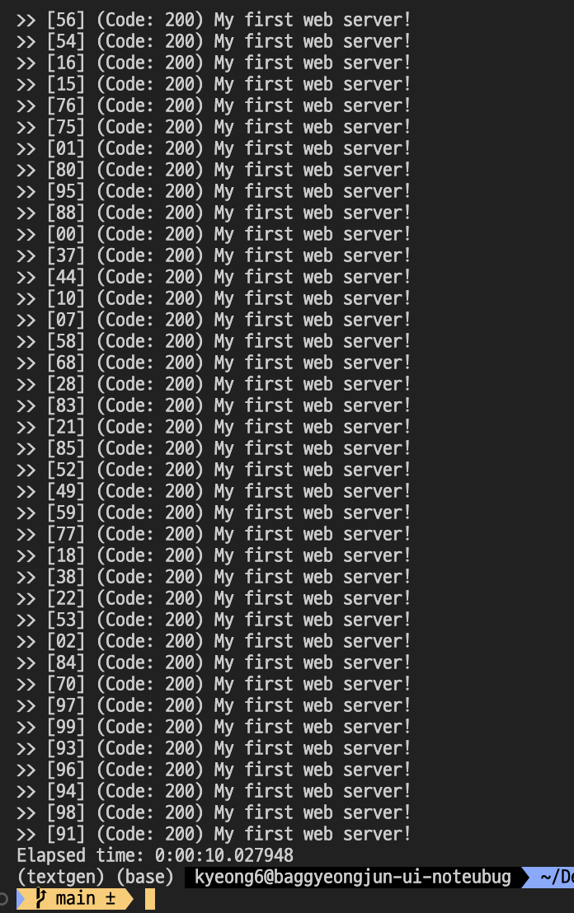

## #1. My first web-server

### 순서

1. server.c를 컴파일하고 실행
2. 웹브라우져를 통해 http://localhost:8090/ 로 접속 후 server.c의 sleep 주석을 uncomment한 후 여러 개의 동시접속을 수행(accesses.py 이용)
3. fork를 server.c에 추가하여 `sleep(5);` 가 존재하여도 여러 요청을 잘 처리할 수 있게 구현

### 설명

#1. My first web-server에서는 `fork()` 를 수행하여 여러개의 process(Multi-Process)를 만들어 입력에 대한 요청을 1대1 대응 시킵니다. 

이를 통해, `Queue` 가 가득 찰 일이 발생하지 않아 `sleep(5);` 코드가 존재하여도 accesses.py를 통해 생성한 요청을 잘 처리할 수 있습니다. 

코드를 통해 단계 별로 설명을 하겠습니다.

**fork 수행**

```c
// fork 수행
pid_t pid;
pid = fork();
```

pid를 저장할 변수를 선언한 후 자식 프로세스를 생성한다. 이때 부모/자식의 pid는 다르므로 따로 조건문을 설정하여 로직 수행이 필요하다.

**Parent 수행 코드**

```c
// parent 수행
if (pid > 0) {
    close(new_socket);
}
```

fork()가 성공하면 child process를 생성하고 해당 child process의 `pid` 를 반환한다. 자식 프로세스의 fork의 반환값은 0이므로 `if (pid > 0)` 조건문을 사용하여 부모 수행 로직을 구현한다.

- `close(new_socket)`  : 부모 프로세스에서 new_socket이라는 socket 파일을 닫는 함수 호출
    - **궁금한 점** : **왜 부모 프로세스에서 close(new_socket)을 호출할까?**
    - fork()를 호출한 후에 자식 프로세스와 부모 프로세스 모두 new_socket 파일의 복사본을 가지게 된다. 두 프로세스가 동시에 같은 소켓을 사용하게 되면 충돌이 발생할 수 있으므로 역할을 나눈다.
    - 자식 프로세스 : 네트워크 담당할 프로세스
    - 부모 프로세스 : socket을 닫아 자원 분리
    - **결론** : 자식 프로세스는 연결을 담당하고, 부모 프로세스는 연결 관리 외의 다른 작업을 수행하거나 새로운 연결을 기다리는 역할을 담당한다. 결국 이를 통해 시스템 `안정성`과 `확장성`이 향상된다.

**Child 수행 코드**

```c
// child 수행
else {
		char buffer[30000] = {0};
		valread = read( new_socket , buffer, 30000);
		printf("%s\n",buffer );
		// uncomment following line and connect many clients
		sleep(5);
		write(new_socket , hello , strlen(hello));
		printf("-------------Hello message sent---------------");
		close(new_socket);
}
```

else구문으로 자식 프로세스의 fork의 반환값은 0이므로 `pid == 0` 일 경우 해당 조건문이 실행된다. 

**fork 생성 후 수행 결과(각 파일 terminal에서 실행 후 결과 일부분 캡쳐)**

- server_01.c



- accesses.py



---

## #2. My second web server

### 순서

1. server.c를 컴파일하고 실행
2. 웹브라우져를 통해 http://localhost:8090/로 접속 후 server.c의 sleep 주석을 uncomment한 후 여러 개의 동시접속을 수행(accesses.py 이용)
3. pthread 라이브러리를 활용하여 server.c에 추가한 후 `sleep(5);` 가 존재하여도 여러 요청을 잘 처리할 수 있게 구현

### 설명

#2. My second web-server에서는 `pthread`를 수행하여 여러 개의 thread(Multi-Thread)를 만들어 입력에 대한 요청을 1대1 대응 시킵니다. 

Multi-Thread 방식의 socket을 구현하기 위해서 기본적으로 제공된 코드(server.c)에 새로운 함수 정의 및 while문을 수정하였습니다.

코드를 통해 단계 별로 설명을 하겠습니다.

**연결 관리 함수**

```c
// thread에서 실행되며 client와 연결을 관리하는 함수
void *socket_connection(void *socket_desc) {
    int sock = *(int*)socket_desc;
    char buffer[30000] = {0};
    char *hello = "HTTP/1.1 200 OK\nContent-Type: text/plain" \
                  "Content-Length: 20\n\nMy first web server!";
    read(sock, buffer, 30000);
    printf("%s\n", buffer);
    sleep(5);
    write(sock, hello, strlen(hello));
    printf("-------------Hello message sent---------------\n");
    close(sock);
    free(socket_desc);
    return 0;
}
```

기존 구조(server.c)의 while문 안에 존재하는 클라이언트로부터의 연결을 수락하고 데이터를 받아 처리한 후 응답을 보내고 연결을 종료하는 과정을 따로 `socket_connection` 함수로 구현하여 thread에서 실행할 수 있게 하였습니다. 기본 구조에서 추가된 내용은 다음과 같습니다.

- socket descriptor 추출 및 메모리 해제
    - 함수의 시작 부분에서 `socket_desc` 포인터를 통해 전달된 socket descriptor를 추출합니다.
    - `int sock = *(int*)socket_desc;` 는 socket descriptor가 void 포인터로 들어왔으므로 int로 형변환을 합니다.
    - `free(socket_desc)` 를 통해 더 이상 필요없는 할당 메모리를 해제합니다.

**→ 해당 부분을 추가한 이유**

해당 부분을 간략하게 소개하자면 multi-thread 환경에서 thread 함수로 전달된 포인터에서 실제 socket descriptor 값을 추출합니다.

pthread_create() 함수는 thread를 생성할 때 단일 매개변수 만을 전달할 수 있고, 해당 매개변수는 void* 타입입니다. multi-thread 서버에서 각 클라이언트 연결은 고유한 socket descriptor(int형)을 가지고 있고, socket descriptor를 thread 함수에 전달하기 위해서 주소를 포인터로 변환하여 전달해야 하며, thread 함수 내에서 해당 포인터를 다시 int형 socket descriptor로 변환해야 합니다. 그러므로 
`int sock = *(int*)socket_desc;` 코드를 작성하여 포인터를 역참조하여 그 안에 저장된 int형의 socket descriptor를 가져옵니다. 

즉, thread가 클라이언트와의 통신에 사용할 정확한 socket descriptor를 확보하기위해서`socket_connection` 함수에 해당 부분을 추가하였습니다.

**while문 변경 내용**

```c
while(1)
    {
        printf("\n+++++++ Waiting for new connection ++++++++\n\n");
        if ((new_socket = accept(server_fd, (struct sockaddr *)&address, 
        (socklen_t*)&addrlen))<0)
        {
            perror("In accept");
            exit(EXIT_FAILURE);
        }
        // thread 생성
        pthread_t tid;
        int *new_sock = malloc(1);
        *new_sock = new_socket;
        if(pthread_create(&tid, NULL, socket_connection, (void*) new_sock) < 0)
        {
            perror("not create thread");
            return 1;
        }
        pthread_detach(tid);
    }
```

주석으로 처리한 thread 생성 부분 이전은 기본 구조(server.c)와 동일하고 이후 부분이 새롭게 작성한 코드입니다. 

- thread 생성 및 관리
    - thread 식별자인 `tid` 를 변수로 설정합니다.
    - thread 함수에 소켓 정보를 안전하게 전달하기 위해 `int *new_sock = malloc(1);` 를 통해 각 클라이언트 socket에 대한 포인터를 동적으로 할당합니다.
    - `pthread_create` 함수를 호출하여 `client_handler` 함수를 thread의 실행 함수로 설정하고 클라이언트의 socket 정보를 전달합니다.
    - thread가 종료될 때 자동으로 모든 자원을 해제하기 위해서 `pthread_detach` 함수를 호출하여 생성된 thread를 분리합니다.

**궁금한 점**

1. pthread_create 함수의 인자는 무엇이 있을까?
2. 왜 pthread_create 함수 return 값이 무엇이길래 조건문에 부등식을 작성했을까?

**1번에 대한 답변**

- 첫 번째 인자(&tid)
    - thread를 가르키는 포인터
    - 반드시 pthread_t 타입으로 선언 필요(`pthread_t tid;` 로 선언한 이유)
- 두 번째 인자(NULL)
    - thread의 특정한 설정 옵션
    - 일반적으로 NULL로 설정
- 세 번째 인자(socket_connection)
    - 해당 thread가 수행할 함수명
- 네 번째 인자((void*) new_sock)
    - 세 번째 인자로 들어간 함수가 필요로 하는 매개변수

**2번에 대한 답변**

- pthread_create 함수의 반환값은 성공 여부에 따라 다르다
    - 0 : 스레드를 성공적으로 생성
    - 0이 아닌 경우 : 생성되지 못해서 에러가 발생
- 그러므로 부등식을 사용하여 로직을 수행한다.

**multi-thread 생성 후 수행 결과(각 파일 terminal에서 실행 후 결과 일부분 캡쳐)**

- server_02.c



- accesses.py



---

## #3. Orchestration and Load-balancing

### 순서

1. server.c에 10칸정도의 크기를 가지는 메세지 큐를 추가
2. 메시지 큐의 용량이 80%(8칸)가량 찼다면 서버 로직을 추가, 이후 메시지큐 메시지들은 추가된 로직들끼리 돌아가며 처리(Round-robin)하도록 수행
3. 반대로 메시지큐의 용량이 20%(2칸)이하로 유지되면 서버 로직을 제거, 이때 첫 번째 로직은 삭제하지 않음
    1. 메시지 수신 속에 따라 서버 로직의 개수의 변화를 확인 추천(1~100개 정도)

### 구현하기 전 필요 개념 정리

**메시지 큐(Message Queue)**

메시지 큐는 프로세스 또는 프로그램 인스턴스가 데이터를 서로 교환할 때 사용하는 통신 방법 중 하나로, 객체지향 미들웨어(Message Oriented Middleware, MOM)을 구현한 시스템입니다. 

즉, 메시지지 큐는 메시지를 임시로 저장하는 간단한 `버퍼` 라고 할 수 있고, 메시지를 송·수신하기 위해 중간에 메시지 큐를 두는 것입니다.


### 설명

#3. Orchestration and Load-balancing에서는 앞에서 구현한 process, thread 방식의 비용적인 문제를 해결하기 위해 실제 서비스들이 사용하는 Orchestration과 Load-balander 방식을 구현합니다.

- Orchestration
    - 현재 트래픽의 양에 따라 미리 서버의 용량을 증가 / 감소
- Load-balancing
    - 애플리케이션을 지원하는 리소스 풀 전체에 네트워크 트래픽을 균등하게 배포

**목표**

c언어에서 queue를 제공하는 라이브러리가 존재하지만 현재 `자료구조` 과목을 수강하고 있어 직접 구현하기로 결정하였습니다. 

**mutex 사용**

```c
// 스레드 간 동기화를 위한 뮤텍스
pthread_mutex_t mutex_lock;  
```

해당 부분은 `mutex`를 정의하는 코드로 `mutex` 를 사용하여 multi-thread 환경에서 공유 자원에 대한 접근을 제어할 수 있게 됩니다.

**구조체 정의**

```c
// 노드 구조체 정의
typedef struct Node {
    // 클라이언트 소켓 파일 디스크립터
    int socket_fd;  
    struct Node* next;
} Node;

// 큐 구조체 정의
typedef struct Queue {
    Node* front;
    Node* rear;
} Queue;
```

Node, Queue 구조체를 정의하는 코드입니다.

- Node : Queue의 각 노드를 정의하며, 클라이언트 소켓 파일 디스크립터, 다음 노드 포인터를 포함합니다
- Queue : Queue의 앞/뒤 포인터를 포함합니다.

**Queue 초기화 및 insert, pop 함수 구현**

```c
// 큐 초기화 함수
void initialize_queue(Queue* queue) {
    queue->front = NULL;
    queue->rear = NULL;
}

// 큐에 새로운 노드를 추가하는 함수
void insert(Queue* queue, int socket) {
    Node* new_node = (Node*)malloc(sizeof(Node));
    new_node->socket_fd = socket;
    new_node->next = NULL;

    if (queue->rear == NULL) {
        queue->front = new_node;
        queue->rear = new_node;
    } else {
        queue->rear->next = new_node;
        queue->rear = new_node;
    }
}

// 큐에서 노드를 제거하고 소켓을 반환하는 함수
int pop(Queue* queue) {
    if (queue->front == NULL) {
        return -1; // 큐가 비어있음
    }

    Node* temp_node = queue->front;
    int socket = temp_node->socket_fd;
    queue->front = queue->front->next;

    if (queue->front == NULL) {
        queue->rear = NULL;
    }

    free(temp_node);
    return socket;
}

// 큐의 크기를 반환하는 함수
int get_queue_size(Queue* queue) {
    int size = 0;
    Node* current_node = queue->front;
    while (current_node != NULL) {
        size++;
        current_node = current_node->next;
    }
    return size;
}

```

해당 부분은 구조체로 정의한 Queue를 초기화하고, Message Queue에 message를 삽입하고 빼오기 위한 `insert` 및 `pop` 을 구현하였습니다.

**변수 정의**

```c
// 클라이언트 연결을 저장하는 큐
Queue connection_queue;

// 활성화된 스레드 수
int active_threads = 1;  
```

클라이언트 연결을 저장하는 Queue인 `connection_queue` 와 활성화된 스레드 수 파악을 위한 `active_threads` 를 정의하였습니다.

**Client 요청 처리**

```c
// 클라이언트 요청을 처리하는 함수
void *client_handler(void *arg) {
    int thread_id = *((int *)arg);
    int queue_size = get_queue_size(&connection_queue);

    int client_socket;
    while (queue_size >= 2 || (queue_size > 0 && active_threads > 1)) {
        pthread_mutex_lock(&mutex_lock);
        client_socket = pop(&connection_queue);
        pthread_mutex_unlock(&mutex_lock);

        if (client_socket != -1) {
            long valread;
            char buffer[30000] = {0};
            char response[30024] = {0};
            valread = read(client_socket, buffer, 30000);
            printf("Thread %d received: %s\n", thread_id, buffer);

            sleep(5);

            sprintf(response, "HTTP/1.1 200 OK\nContent-Type: \
            text/plain\nContent-Length: 20\n\nMy first web server!\n");
            write(client_socket, response, strlen(response));
            printf("Thread %d sent response\n", thread_id);

            close(client_socket);
            queue_size = get_queue_size(&connection_queue);
        }
    }

    printf("Thread %d exiting. Active threads: %d\n", thread_id, active_threads - 1);
    active_threads--;
    pthread_exit(NULL);
}

```

server_02.c에서 구현한 client_handler를 server_03.c에서 추가적으로 필요한 내용을 넣어서 수정하였습니다. 추가된 내용은 다음과 같습니다.

- 해당 부분에서 while문을 통해 `queue_size` 를 확인합니다.
- `pthread_mutex_lock` 과 `pthread_mutex_unlock` 으로 Queue에 대한 접근을 동기화하였습니다
- 요청을 처리한 후 `active_thread` 를 감소시키고 종료 메시지를 출력하게 하였습니다.

**Server Logic 관리**

```c
// 서버 로직 함수
void manage_server() {
    int queue_size = get_queue_size(&connection_queue);

    // 큐에 8개 이상의 요청이 있는 경우 새로운 스레드를 생성
    if (queue_size >= 8) {
        pthread_t new_thread;
        int thread_id = active_threads + 1;
        pthread_create(&new_thread, NULL, client_handler, &thread_id);
        active_threads++;
        printf("Created new thread.");
    }
}
```

해당 부분은 Queue의 갯수를 파악하며 `server_logic` 을 관리하는 부분으로 Queue에 8개 이상의 요청이 있는 경우를 조건문으로 하여 `True` 을 경우 새로운 스레드를 생성하고 활성화된 스레드 수를 증가시킵니다.

**main()**

```c
int main(int argc, char const *argv[]) {
    int server_fd, client_socket;
    struct sockaddr_in server_address;
    int address_len = sizeof(server_address);

    // socket 생성
    if ((server_fd = socket(AF_INET, SOCK_STREAM, 0)) == 0) {
        perror("In socket");
        exit(EXIT_FAILURE);
    }

    server_address.sin_family = AF_INET;
    server_address.sin_addr.s_addr = INADDR_ANY;
    server_address.sin_port = htons(PORT);
    memset(server_address.sin_zero, '\0', sizeof server_address.sin_zero);

    // socket bine
    if (bind(server_fd, (struct sockaddr *)&server_address, sizeof(server_address)) < 0) {
        perror("In bind");
        exit(EXIT_FAILURE);
    }

    // 연결 대기열 설정
    if (listen(server_fd, 10) < 0) {
        perror("In listen");
        exit(EXIT_FAILURE);
    }

    initialize_queue(&connection_queue);

    while (1) {
        printf("\n+++++++ Waiting for new connection ++++++++\n\n");
        printf("Queue size: %d\n", get_queue_size(&connection_queue));
        printf("Thread count: %d\n", active_threads);

        if ((client_socket = accept(server_fd, (struct sockaddr *)&server_address, (socklen_t *)&address_len)) < 0) {
            perror("In accept");
            exit(EXIT_FAILURE);
        }

        pthread_mutex_lock(&mutex_lock);
        // 요청을 큐에 추가
        insert(&connection_queue, client_socket); 
        manage_server();
        pthread_mutex_unlock(&mutex_lock);
    }

    return 0;
}

```

`main` 함수는 해당 과정을 실행하기 위한 부분으로 #2와 비교하여 추가한 부분만 설명하도록 하겠습니다.

- Queue 사용
    - 클라이언트의 요청을 Queue(connection_queue)에 저장하고, 스레드가 Queue에서 요청을 가져와 처리합니다.
- Mutex 사용
    - Queue에 대한 접근 동기화를 위해 mutex_lock를 사용하빈다

**수행 결과**

- server_03.c


- accesses.py



### **결론**

교수님이 제공하신 PDF 내용인 #3의 순서에서 **`Step 0) 아마 2번의 문제에 이어서 시작한다면 조금 수월할 겁니다!`**를 이해하는 것을 초점으로 두었습니다. 메시지 큐를 구현하는데 왜 #2 방식인 멀티 스레드를 이어서 시작한다면 조금 수월하다는 것인지 의문이 있었습니다.

이에 대한 의문은 서버가 시작되면 **`server_logic`** 함수를 각 스레드에서 실행되게 한다면 조건에 부합하게 구현할 수 있겠다고 생각하게 되어 이해가 되었습니다.

즉, **`client_handler`** 함수가 별도의 스레드에서 실행되며, 서버의 주요 작업을 담당하게 만들고 각 스레드는 해당 함수(로직)을 통해 메시지 큐에서 클라이언트 연결을 하나씩 꺼내어 해당 요청을 처리하는 흐름을 구성하였습니다.

이렇게 함으로써, 멀티 스레드 환경에서의 동시성 문제를 해결하고, 클라이언트 요청을 효과적으로 처리할 수 있는 구조를 구현할 수 있었습니다. 메시지 큐를 사용하여 각 스레드가 클라이언트 요청을 순차적으로 처리할 수 있게 되었고, 이를 통해 서버의 안정성과 성능을 향상시킬 수 있었습니다.

특히 `Queue와 Mutex`를 사용하여 클라이언트 요청을 동기화하고 관리함으로써 멀티 스레드 환경에서의 데이터 일관성을 유지할 수 있었습니다. 

이를 통해 각 스레드는 안정적으로 요청을 처리하고 응답할 수 있었습니다.

---

## #4. What is the difference between #1 and #2?

### 순서

1. server.c의 대략적인 동작 설명
2. #1의 접근방법과 #2의 접근방법의 장단점, 동작형태 등을 설명

### 설명

**server.c 동작 설명**

server.c 파일은 간단한 HTTP(Request/Response) 서버를 구현하고 있으며, `PORT 8090` 에서 요청을 수락하고 응답을 보내는 기능을 수행합니다. 

크게 `while문` 과 이전 코드로 나눌 수 있습니다.

while문 이전 코드는 서버 소켓 초기화 및 설정, 소켓 바인딩 및 연결 수신대기를 수행합니다.

<aside>
💡 **소켓 바인딩이란?**
소켓 번호는 응용 프로그램이 알고 있는 통신을 위한 접속점이고, 소켓주소(IP + port)는 TCP와 같은 전송 계층이 알고 있는 통신 접속점이므로, 둘의 관계를 묶어(bind)두어야 응용 프로그램과 네트워크 시스템 간에 데이터 전달이 가능합니다.

</aside>

while문은 클라이언트의 연결을 수락하고 이에 대한 응답을 처리하는 코드입니다. 해당 부분에 있는 함수에 대한 설명은 다음과 같습니다.

- accept() :  클라이언트의 연결 요청을 수락하고, 통신을 위한 새로운 소켓(new_socket)을 생성합니다.
- read() : 클라이언트로부터 데이터를 받아 buffer에 저장합니다.
- write() :  클라이언트에게 HTTP 응답 메시지를 전송합니다.
- close(new_socket) : 클라이언트와의 연결을 종료합니다.

**#1의 접근방법과 #2의 접근방법 장단점 및 동작형태**

- 동작형태
    - #1. My first web server
        - Fork를 이용한 Multi-Process 서버
        - 자식 프로세스에서는 클라이언트와의 통신을 처리하고, 부모 프로세스는 소켓을 닫고 새 연결을 기다리는 방식입니다.
    - #2. My second web server
        - Multi-Thread 서버
        - 각각의 스레드는 독립적으로 클라이언트의 요청을 처리하고, 작업 완료 후 자원을 해제(detach)합니다.

- 장점
    - #1. My first web server
        - 프로세스가 격리된 구조로 자식 프로세스가 문제가 발생하여도 다른 프로세스에 영향을 주지 않습니다.
        - Fork를 이용하므로 자식 프로세스는 부모 프로세스의 자원을 복제하여 독립적인 실행 환경을 갖는 장점이 있습니다.
    - #2. My second web server
        - 모든 스레드가 같은 프로세스의 자원을 공유하므로 데이터 공유가 용이하고 자원 사용이 효율적입니다.
        - 스레드 생성과 문맥 교환(context-switching)이 #1의 동작형태인 프로세스에 비해 비용이 적게 듭니다.

- 단점
    - #1. My first web server
        - 각 프로세스는 메모리와 CPU 자원을 별도로 사용하여 자원 사용이 비효율적입니다.
        - #2의 방식인 스레드에 비해 생성 및 초기화 비용이 많이 듭니다.
    - #2. My second web server
        - 하나의 스레드가 문제가 발생한다면 전체 프로세스에 영향을 주어 안정성이 좋지 않습니다.
        - 스레드가 자원 공유는 데이터 일관성에 대한 문제가 발생할 수 있습니다.(교착상태)

<aside>
💡 **#2. My second web server의 교착상태**
해당 방식의 문제점은 Mutex, Semaphore를 도입하여 해결할 수 있습니다.

</aside>